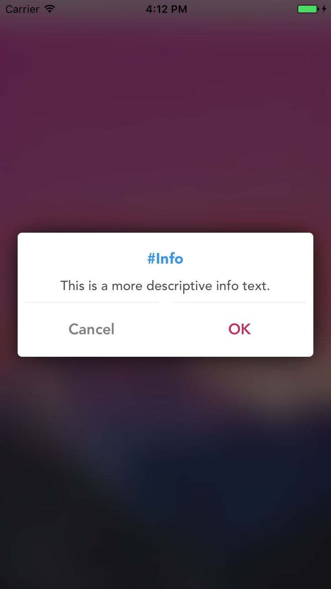
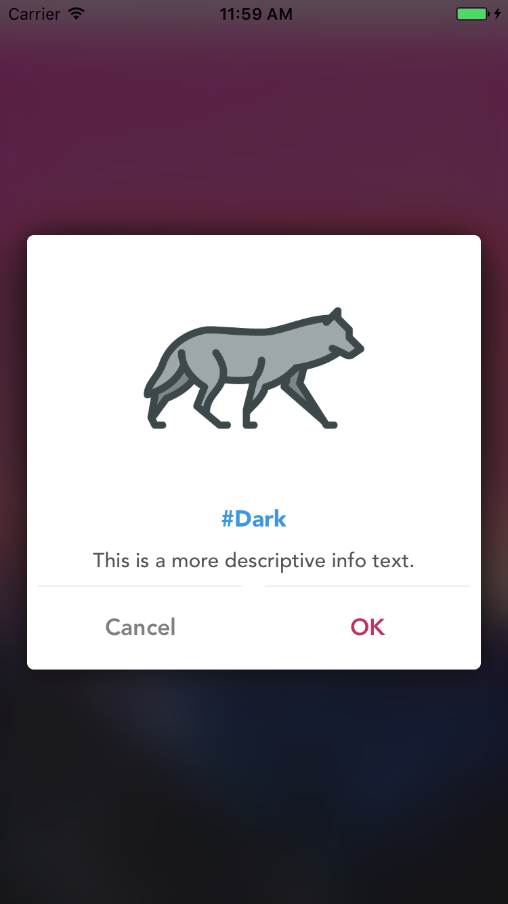
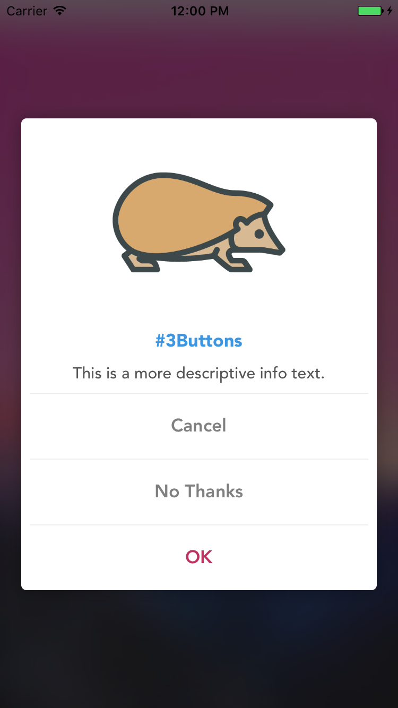

# NKAlertView

[](https://github.com/Carthage/Carthage)
[](https://cocoapods.org/pods/NKAlertView)

Easily customizable AlertView library available.It is written in swift.

<p align="center">
  
  
  
</p>


## Installation

#### Cocoapods

To integrate NKAlertView into your Xcode project using CocoaPods, specify it in your Podfile and run pod install.

```
platform :ios, '9.0'
use_frameworks!

pod 'NKAlertView'
```

#### Carthage

Just add to your Cartfile:
```
github "nukesk3/NKAlertView"
```

#### Manually

Download and drop `/NKAlertView` folder in your project.


## How to use
```swift
let alert = NKAlertView(title: "title",description: "This is a more descriptive info text.",image: UIImage(named: "image.png"),style: .dark)

alert.addAction(NKAlertAction(title: "Cancel", style: .cancel, action: { () -> Void in
  print("Cancel")
}))

alert.addAction(NKAlertAction(title: "OK", style: .default, action: { () in
  print("OK")
}))

self.present(alert, animated: true, completion: nil)
```

## Contributing

welcome the feature request or bug report feedback.


## License

NKAlertView is available under the MIT license. See the LICENSE file for more info.
